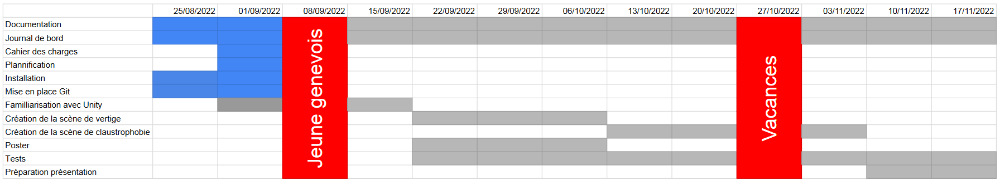

# Cahier des charges

## Sujet
Créer un jeu en VR qui simule des situations de phobies

## But
Créer un jeu en VR qui permet de se mettre dans des situations qui peuvent déclancher des phobies.

Le joueur arrivera devant un menu où il choisit la situation qu'il veux faire.

Dépandant de la situation, le joueur devra ou non se déplacer.

Si le joueur:
- Doit de déplacer, il devra atteindre un point d'arrivé
- S'il reste sur place, il devra tenir jusqu'a la fin de la situation.

## Spécifications
Le jeu aura 2 situation, une de vertige et une de claustrophobie.

Dans la première, le joueur devra se déplacer de toit d'immeuble en toit et le point d'arrivée se trouve au dessu de l'immeuble le plus haut.

Dans la deuxième, le joueur sera au millieu d'une grande salle qui se rapetissera petit à petit et il devra tenir jusqu'a ce qu'elle s'arrête.

A tout moment, le joueur peut maintenir pendant 2 seconde une combinaison de bouton pour retourner au menu.

## Restrictions
- Le jeu ne sera disponible que pour les casques VR Meta
- Que deux simulations pour le moment, vertige et claustrophobie

## Environnement
- Language : C#
- Environnement
    - Windows 10
    - Unity
    - Visual Studio 2022
- Matériel : Casque VR Oculus/Meta Quest 2
- Versionning : Git
- Documentation : MkDocs

## Livrables
- Poster
- Documentation
- Journal de bord
- Code source du projet

## Rédditions
2022.10.13 : Rendu du poster

2022.10.23 : Rendu du rapport intermédiaire

2022.11.20 : Rendu final

2022.11.24 : Exposé oral

## Planning
